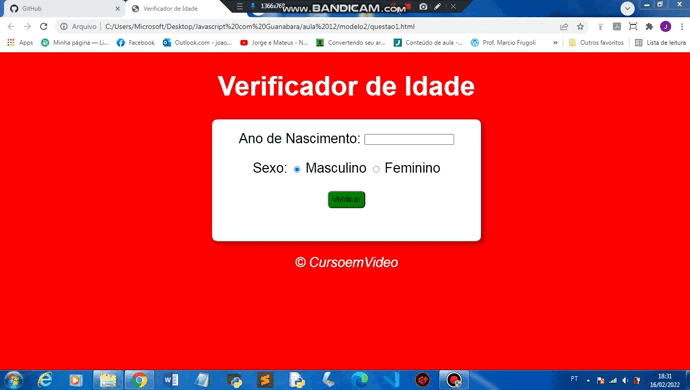
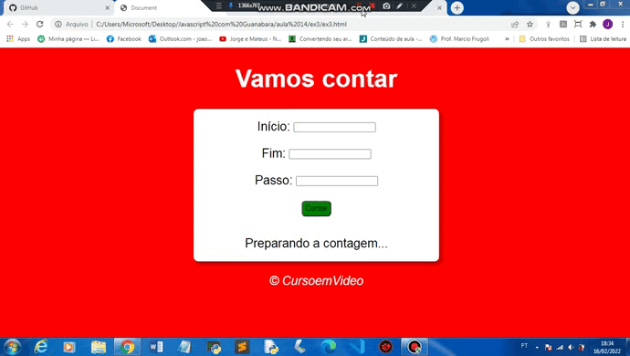
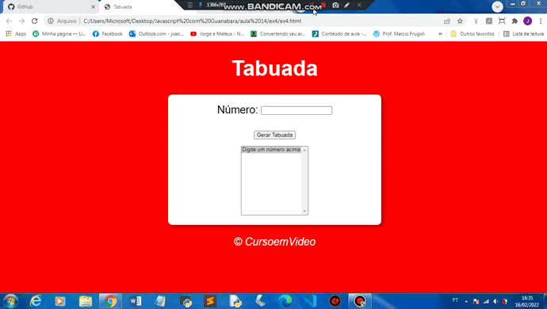
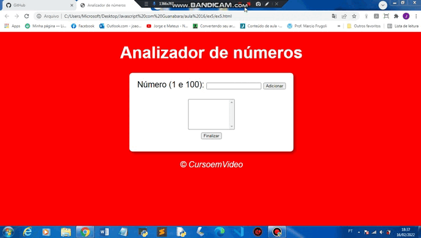

# Curso de Javascript

### Sobre o Curso:

* j
* k
* l

### Veja os Exercícios, mais interessantes:

* #### Exercício da Aula 

* #### Exercício da Aula 

* #### Exercício da Aula 

* #### Exercício da Aula 

